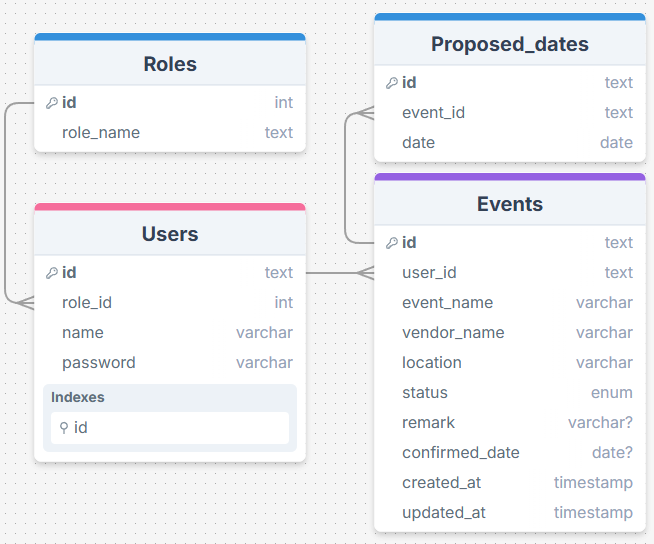
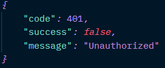
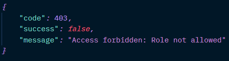

# Booking-event-server

## Overview

This API provides endpoints for managing a Booking event application. It allows users to register, log in, and perform CRUD (Create, Read, Update, Delete) operations on their booking events.

#### Technologies Used

- **Go**: A powerful programming language used for building scalable and efficient applications.
- **Gorm** : An ORM library for managing database interactions.
- **Gin** : A high-performance HTTP web framework in Go.
- **JWT**: Utilized for generating and verifying JSON Web Tokens for authentication.
- **bcryptjs**: Used for securely hashing passwords.

### Documentation

- [postman](https://documenter.getpostman.com/view/36914326/2sAYHxnPdy)
- [swagger](http://localhost:5000/swagger/index.html) (Server must running locally)

## Prerequisites

Before using the API server, ensure that you have:

- **Visual Studio Code** or any IDE.
- **Go** installed on your system.

### Database design



### Authentication

The API server uses a bearer token authentication mechanism to secure endpoints. Clients are required to include a valid JWT (JSON Web Token) in the `Authorization` header of their requests.



```ts
func Authentication(c *gin.Context) {
    userData, err := helper.GetToken(c)
    if err != nil {
        if err == jwt.ErrTokenExpired {
            errorhandler.HandleError(c, &errorhandler.UnauthorizedError{
                Message: "Token expired, please re-login",
            })
            c.Abort()
            return
        }

        errorhandler.HandleError(c, &errorhandler.UnauthorizedError{
            Message: "Unauthorized",
        })
        c.Abort()
        return
    }

    c.Set("user", use

rData)
    c.Next()
}
```

### Authorization



```ts
func authorization(allowedRoles []int64) gin.HandlerFunc {
    return func(c *gin.Context) {
        userData, exists := c.Get("user")
        if !exists {
            errorhandler.HandleError(c, &errorhandler.AccessForbiddenError{
                Message: "User data not found in context",
            })
            c.Abort()
            return
        }

        roleID := userData.(map[string]interface{})["role_id"]
        roleAllowed := false
        for _, allowedRole := range allowedRoles {
            if roleID == allowedRole {
                roleAllowed = true
                break
            }
        }

        if !roleAllowed {
            errorhandler.HandleError(c, &errorhandler.AccessForbiddenError{
                Message: "Access forbidden: Role not allowed",
            })
            c.Abort()
            return
        }

        c.Next()
    }
}

var HrAuth = authorization([]int64{1})
var VendorAuth = authorization([]int64{2})
```

## Endpoints

|                               | Method | Patch                                      | Auth (Bearer token) | Req.body                                                           |
| ----------------------------- | ------ | ------------------------------------------ | ------------------- | ------------------------------------------------------------------ |
| User registration             | POST   | *baseUrl*/api/v1/auth/register             | no                  | name: string,<br>role: string,<br/>password: string                |
| User login                    | POST   | *baseUrl*i/v1/auth/login                   | no                  | name: string, password: string                                     |
| User detail                   | GET    | *baseUrl*/v1/user                          | yes                 | -                                                                  |
| get all vendors               | GET    | *baseUrl*/v1/vendors                       | yes                 |                                                                    |
| Create booking event          | POST   | *baseUrl*/api/event/hr                     | yes                 | event_name: string, proposed_dates: []string,<br/>location: string |
| Get booking events by User_ID | GET    | *baseUrl*/api/event/hr                     | yes                 | -                                                                  |
| Update todo                   | PUT    | *baseUrl*/v1/api/event/hr/:event_id        | yes                 | event_name: string, proposed_dates: []string,<br/>location: string |
| Delete todo                   | DELETE | *baseUrl*/v1/api/event/hr/:event_id        | yes                 |                                                                    |
| Get Booking Event By ID       | GET    | *baseUrl*/v1/api/event/hr/:event_id        | yes                 |                                                                    |
| Get All booking events        | GET    | *baseUrl*/api/event/vendor                 | yes                 |                                                                    |
| Confirm Date                  | Patch  | *baseUrl*/api/event/vendor/event_id        | yes                 | confirmed_date: "DD/MM/YYYY"                                       |
| Reject Dates                  |        | *baseUrl*/api/event/vendor/reject/event_id | yes                 | remark: string                                                     |

## User for testing

###### Role vendor

```json
{
    "name": "vendor 1",
    "password": "abc123"
}
```

###### Role HR

```json
{
    "name": "hr company 1",
    "password": "abc123",
}
```

## Tutorial: Using the API locally

Follow these steps to use the API server:

- **Clone the Repository**: Clone the API server repository from GitHub to your local machine.
  
  ```bash
  git clone https://github.com/RPrasetyoB/booking-event-server.git
  ```

- **Navigate to the cloned directorys**:
  
  ```bash
  cd booking-event-server
  ```

- **Set Up Environment Variables**:  For testing purposes, a `.env` file is included in the repository. Make sure it is properly configured.

- **Install Dependencies**: Install dependencies using following command:

- ```bash
  go mod tidy
  ```

- **Run the Server**: Start the API server locally using the following command:
  
  ```bash
  go run .
  ```

- The API server is ready to be consumed at "http:localhost:'PORT in `.env`' or 5001"

**Note**:
If you encounter issues with fetching data or connecting to the database, try resend request again. And if still get issue please don't hesitate to contact me. Since I'm using a free account on Supabase, the database may freeze if it's not used for a while
